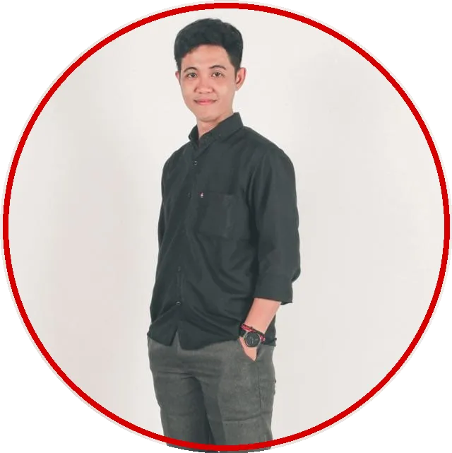

# Robby Aliasa Akbar

### Applied AI Systems Builder, Creative Director, Hardware Tinkerer

  
  
  

### Who I Am

My name is Robby Aliasa Akbar. Most people call me Bang Rob or Obi. I am thirty one, living in Bekasi, Indonesia.

I am an applied AI systems builder, a hardware tinkerer, and a business owner with ten years behind me as a Creative Director. 

Here is the straight talk on what I do: I do not build toys or chase empty AI hype. I take messy operational problems, strip away the noise, and engineer local AI setups and deterministic workflows that survive real daily work. If a system cannot save real hours or protect real revenue, I do not bother with it.

---

### The Real Trajectory

Look, I did not take the comfortable computer science path.

Back when I was fifteen in high school, I had zero cash and endless curiosity. I spent nights cracking Windows, patching PES files so player transfers stayed updated, and hanging around XDA Developers. 

My phone was stuck on Android Jelly Bean and struggled with basic tasks. If I wanted to play games without lag, I had to understand the plumbing. That meant unlocking bootloaders, flashing custom ROMs, and patching custom kernels myself just to squeeze extra frames out of cheap silicon. That habit of pushing hardware past its limit never went away.

When I stepped into visual arts, the hustle stayed identical. I started on cracked copies of Adobe CS3 and CorelDraw because paying for subscriptions was impossible back then. But I put in the daily hours. That start turned into a ten year career in the creative industry, climbing all the way to Creative Director. It gave me an instinctive eye for visual composition, human psychology, and clean communication.

---

### The Business Reality Check

A few years back, I built my own company called InDeepCleaningID. We handle deep wet cleaning for soft furniture across Greater Jakarta using our own QDWC method.

Running an actual service business with field crews and daily customer chaos hits hard. I checked the available SaaS tools and their monthly fees, and the math felt like highway robbery. Paying recurring bills for bloated software that breaks under pressure made zero sense.

So the teenage XDA tinkerer woke up again.

I automated our entire operations using open source tools and local models. Out of two hundred sixty six workflow nodes managing chats, scheduling, follow ups, and invoices, only four nodes call AI. The rest runs on pure deterministic logic. 

The payoff is zero hallucinations, zero dropped appointments, and about ninety percent of daily operations running on autopilot.

---

### What I Build Today

My cleaning business is my living test lab. I document my builds as public experiments where every failure, fix, and benchmark is on record.

- **Found the bug, fixed the stack**: Tracked down why ROCm crashed on AMD RX 6700 XT gfx1031 silicon, bypassed HSA overrides natively, and got my fix merged upstream in llama.cpp. [Case Study](https://robbyaliasaakbar.github.io/exp008.html)
- **Mass CV screening pipeline**: Cut candidate PDF evaluation from thirty minutes of manual skimming down to under five seconds without relying on fragile in system prompts. [Case Study](https://robbyaliasaakbar.github.io/exp007.html)
- **Universal auth backend**: Built a shared authentication service with PHP, SQLite, and Docker, reusing one login gateway across multiple live apps without rewriting boilerplate. [Case Study](https://robbyaliasaakbar.github.io/exp011.html)
- **Internal MCP agent integration**: Connected local models directly into my own custom web applications via internal MCP tools, removing manual data entry entirely. [Case Study](https://robbyaliasaakbar.github.io/exp015.html)
- **Enterprise grade JobTracker**: Rebuilt a static tracking tool into a production system running React, Express, PostgreSQL, and Caddy on a private home server without cloud VPS bills. [Case Study](https://robbyaliasaakbar.github.io/exp016.html)
- **Full stack business frontend**: Shipped an entire services website with dynamic sliders, smooth animations, and complete business logic using pure local AI assistance. [Case Study](https://robbyaliasaakbar.github.io/exp005.html)

I treat AI as a draft engine, never the final truth. Plain logic handles the heavy lifting, and the model only touches what actually needs reasoning.

---

### Systems And Tools

<b>Local AI And Inference</b>

  
  
  
  
  
  
  
  
  
  

<b>Web, Backend, And Database</b>

  
  
  
  
  
  
  
  
  
  
  
  
  
  

<b>DevOps, Cloud, And Networking</b>

  
  
  
  
  
  
  
  
  
  
  
  

<b>Agent Runtimes, CLI, And Interfaces</b>

  
  
  
  
  
  
  
  
  

<b>Creative Suite (10+ Years Daily Mileage)</b>

  
  
  
  
  
  
  
  
  
  
  
  
  

---

### Field Telemetry

  
  
  
  
  

  
  
  
  
  

 

  
<i>Everything tested on bare metal and backed by real revenue. If you want to talk systems, drop a line.</i>

# robbyaliasaakbar
